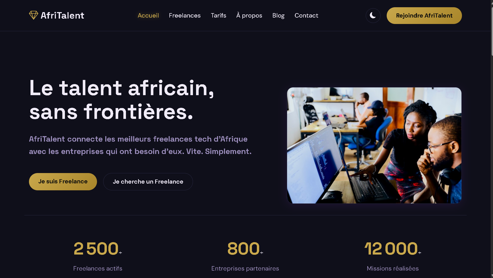
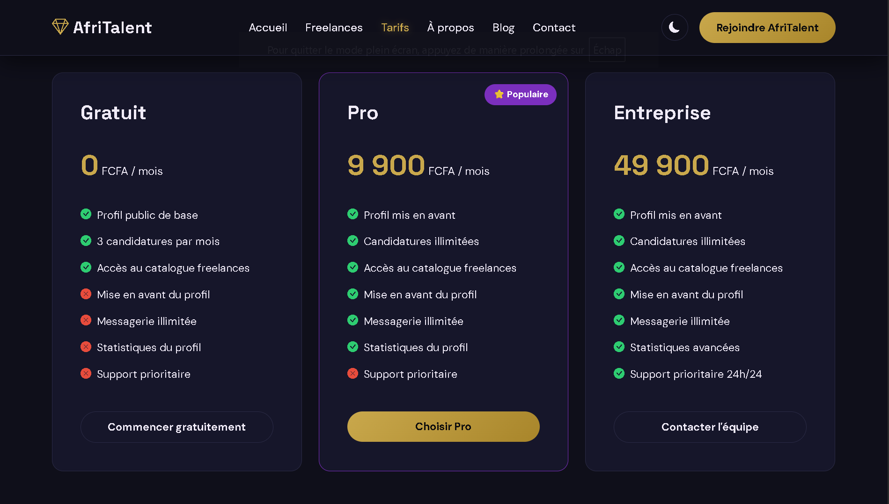
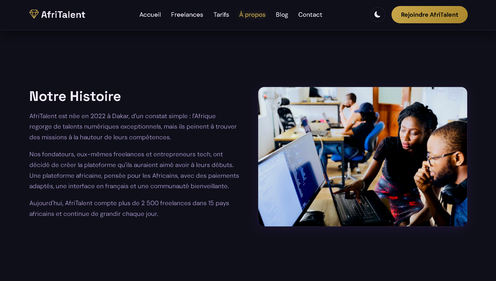
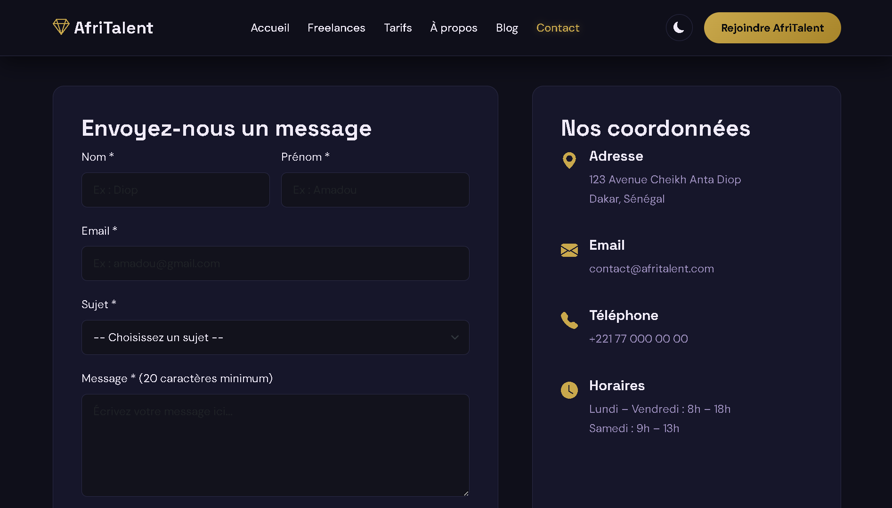

# AfriTalent 💎

Plateforme de mise en relation entre freelances tech africains et entreprises.
Projet de Technologies Web — Roberto Robs.

Dev : Magatte Fall

Pages du site

- `index.html` — Accueil avec hero, bento grid, catégories, témoignages

- `freelances.html` — Catalogue des freelances avec filtrage dynamique

- `tarifs.html` — Plans tarifaires et FAQ accordion

- `about.html` — Histoire, équipe et valeurs

- `contact.html` — Formulaire de contact avec validation

Technologies utilisées

- HTML5 sémantique
- CSS3 (variables, grid, flexbox, responsive)
- JavaScript vanilla (ES6+)
- Bootstrap 5.3
- Bootstrap Icons
- Google Fonts (Space Grotesk, DM Sans)
- Images : Unsplash

Fonctionnalités JavaScript

- Light/dark mode avec localStorage
- Navbar dynamique au scroll
- Compteurs animés (IntersectionObserver)
- Animations fade-in au scroll
- Filtrage dynamique des freelances
- Validation du formulaire de contact

Lien GitHub Pages

https://msfvenom-0.github.io/FALL-MAGATTE-AfriTalent/
